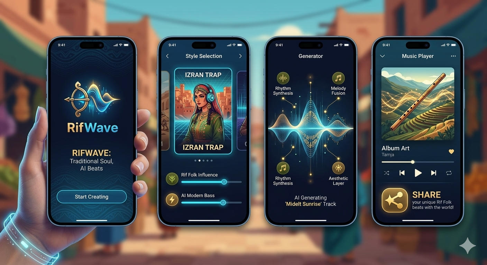

​
[▶️ اضغط هنا لسماع الموسيقى](https://raw.githubusercontent.com/elouafimostapha92-ship-it/RifWave-project-/main/Rif%20Trap%20Caravan.mp3)
# RifWave AI 🎸⚡

**RifWave** is an innovative AI-powered mobile application designed to bridge the gap between traditional cultural heritage and modern music production.

## 🌟 The Vision
The app allows creators to generate unique musical tracks by blending **Moroccan Rif Folk (Izran)** with modern **Heavy Bass/Trap** beats using Generative AI.

## ✨ Key Features
- **AI Fusion Engine:** Seamlessly merges traditional instruments (Loutar, Gasba) with modern 808 Bass.
- **Dynamic Prompting:** Users can describe the mood (e.g., Nostalgia, Passion) and the AI handles the composition.
- **Mobile-First Design:** Built with Flutter for a smooth cross-platform experience.

## 🛠️ Technical Stack
- **Frontend:** Flutter / Dart
- **AI Model:** Integration with MusicGen / Replicate API
- **Backend:** Python (FastAPI) for AI processing

## 📈 Business Potential
This project targets a niche market of content creators and musicians looking for "Ethnic-Electronic" fusion, a rapidly growing trend in the global music scene.

---
*Created with passion for music and technology.*
